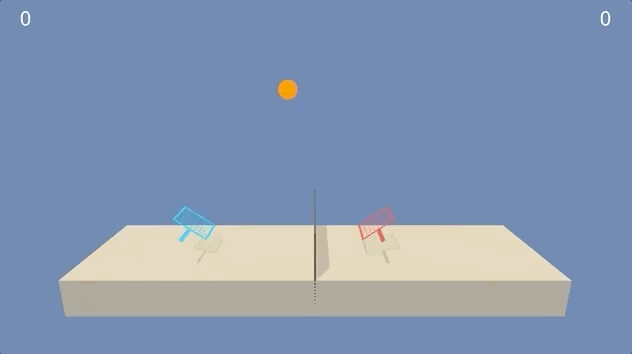

[//]: # (Image References)

# # Collaboration and Competition

## Introduction

### Objective

Train multiple agents to collaborate to in achieving their goals using policy-based (and value-based) methods.



Fig.: Demo snippet video of a smart agent.

### Background

The project solves the [Tennis](https://github.com/Unity-Technologies/ml-agents/blob/master/docs/Learning-Environment-Examples.md#tennis) environment.

In this environment, two agents control rackets to bounce a ball over a net. If an agent hits the ball over the net, it receives a reward of +0.1. If an agent lets a ball hit the ground or hits the ball out of bounds, it receives a reward of -0.01. Thus, the goal of each agent is to keep the ball in play.

The observation space consists of 8 variables corresponding to the position and velocity of the ball and racket. Each agent receives its own, local observation. Two continuous actions are available, corresponding to movement toward (or away from) the net, and jumping.


#### Solving the Environment

The task is episodic, and in order to solve the environment, your agents must get an average score of +0.5 (over 100 consecutive episodes, after taking the maximum over both agents). Specifically,

- After each episode, we add up the rewards that each agent received (without discounting), to get a score for each agent. This yields 2 (potentially different) scores. We then take the maximum of these 2 scores.
- This yields a single **score** for each episode.

The environment is considered solved, when the average (over 100 episodes) of those scores is at least +0.5.

## Getting Started

### Setup

0. Clone the repository
```bash
https://github.com/plopd/multi-agent-control.git
cd multi-agent-control
```

1. Create and activate a new environment with Python 3.6.

	- __Linux__ or __Mac__: 
	```bash
	conda create --name continuous_control python=3.6
	source activate multi-agent-control
	```
	- __Windows__: 
	```bash
	conda create --name continuous_control python=3.6 
	activate multi-agent-control
	```
	
2. Clone and install the openai-gym repository
```bash
cd ..
git clone https://github.com/openai/gym.git
cd gym
pip install -e .
```

3. Create an [IPython kernel](http://ipython.readthedocs.io/en/stable/install/kernel_install.html) for the `multi-agent-control` environment.  
```bash
python -m ipykernel install --user --name multi-agent-control --display-name "multi-agent-control"
```

4. Start (local) jupyter notebook server
```bash
cd ../multi-agent-control
jupyter-notebook
```

**2. Download the Unity Environment**

1. Download the environment from one of the links below.  You need only select the environment that matches your operating system:
    - Linux: [click here](https://s3-us-west-1.amazonaws.com/udacity-drlnd/P3/Tennis/Tennis_Linux.zip)
    - Mac OSX: [click here](https://s3-us-west-1.amazonaws.com/udacity-drlnd/P3/Tennis/Tennis.app.zip)
    - Windows (32-bit): [click here](https://s3-us-west-1.amazonaws.com/udacity-drlnd/P3/Tennis/Tennis_Windows_x86.zip)
    - Windows (64-bit): [click here](https://s3-us-west-1.amazonaws.com/udacity-drlnd/P3/Tennis/Tennis_Windows_x86_64.zip)

2. Place the file in the root of this repo, and unzip (or decompress) the file.

### Instructions

To train an agent run `python train.py`. The python file contains many useful command line arguments:

```
    parser.add_argument(
        "-env_fp",
        "--environment_filepath",
        help="Filepath to environment to load.",
        default="Tennis.app",
    )
    parser.add_argument(
        "-no_gr",
        "--no_graphics",
        help="Whether to display the environment.",
        action="store_true",
        default=True,
    )
    parser.add_argument(
        "-n_episodes",
        "--number_episodes",
        help="Number of episodes to train.",
        default=3000,
        type=int,
    )
    parser.add_argument(
        "-max_t",
        "--maximum_timesteps",
        help="Maximum number of timesteps within one episode.",
        default=2500,
        type=int,
    )
    parser.add_argument(
        "-seed", "--seed", help="Random seed for reproducibility.", default=2, type=int
    )
    parser.add_argument(
        "-save_every_nth",
        "--save_every_nth",
        help="Save checkpoint every nth episode",
        default=25,
        type=int,
    )
    parser.add_argument(
        "-bfsz",
        "--buffer_size",
        help="Buffer size of the replay memory.",
        default=int(1e5),
        type=int,
    )
    parser.add_argument(
        "-bsz",
        "--batch_size",
        help="Batch size of experience to sample from replay buffer.",
        default=256,
        type=int,
    )
    parser.add_argument(
        "-gamma",
        "--gamma",
        help="Discount factor for the cumulative rewards.",
        default=0.99,
        type=float,
    )
    parser.add_argument(
        "-tau",
        "--tau",
        help="Interpolation factor for soft update model parameters.",
        default=1e-3,
        type=float,
    )
    parser.add_argument(
        "-lr_actor",
        "--learning_rate_actor",
        help="Learning rate for SGD on actor's parameters.",
        default=1e-4,
        type=float,
    )
    parser.add_argument(
        "-lr_critic",
        "--learning_rate_critic",
        help="Learning rate for SGD on critic's parameters.",
        default=1e-3,
        type=float,
    )
    parser.add_argument(
        "-weight_decay",
        "--weight_decay",
        help="Weight decay (L2 penalty) for Adam optimizer.",
        default=0,
        type=float,
    )

```

#### Code

`results/` - camera-ready graphs and figures highlighting the results of the training as well as checkpoints of the trained agent.

`utils.py` - helper methods (e.g. saving checkpoints, plotting, ...)

`Collaboration and Competition.ipynb` - notebook with environment setup and demo of a smart agent.

`REPORT.md` - outlines details on the algorithms used to train the agent


