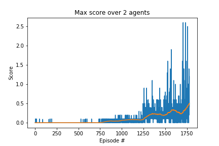

## Learning Algorithm

The agent is trained with [DDPG, Lillicrap, Timothy P., et al. "Continuous control with deep reinforcement learning." arXiv preprint arXiv:1509.02971 (2015)](https://arxiv.org/pdf/1509.02971.pdf).

Specifically, *shared* Actor-Critic and replay buffer are used.

- DDPG is an Actor-Critic model-free algorithm
- It is an modification of the deep Q-learning algorithm to continuous action spaces
- The _actor_ function specifies the current policy by deterministically mapping states to actions. The actor's parameters are updated by gradient ascent on the policy
- The _critic_ function is learning the state-action value function Q using the Bellman Equation
- The actor is approximating the argmax operator on the Q-value in the Bellman Equation
- DDPG is using a _replay buffer_ for sampling experience tuples, is decoupling the parameters being updated from the ones that are producing target values by using a target networks for both actor and critic
- The parameters of the target network are updated _softly_, i.e. they are interpolated between the local parameters and the target parameters using an interpolation factor that is weighting the target network parameters more than the local ones 
- The output of the actor is perturbed with noise using the _Ornstein–Uhlenbeck  process_ to encourage exploratory behavior in the agent

**Neural Network Architectures**

#### Actor

```markdown
----------------------------------------------------------------
        Layer (type)               Output Shape         Param #
================================================================
            Linear-1                  [-1, 256]           6,400
       BatchNorm1d-2                  [-1, 256]             512
            Linear-3                  [-1, 128]          32,896
       BatchNorm1d-4                  [-1, 128]             256
            Linear-5                    [-1, 2]             258
================================================================
Total params: 40,322
Trainable params: 40,322
Non-trainable params: 0
----------------------------------------------------------------
Input size (MB): 0.00
Forward/backward pass size (MB): 0.01
Params size (MB): 0.15
Estimated Total Size (MB): 0.16
----------------------------------------------------------------
```

- Linear(24, 256) - ReLU - BatchNorm - Linear(256, 128) -  ReLU - BatchNorm - Linear(128, 2) - Tanh

#### Critic

```markdown
----------------------------------------------------------------
        Layer (type)               Output Shape         Param #
================================================================
            Linear-1                  [-1, 256]           6,400
       BatchNorm1d-2                  [-1, 256]             512
            Linear-3                  [-1, 128]          33,152
            Linear-4                    [-1, 1]             129
================================================================
Total params: 40,193
Trainable params: 40,193
Non-trainable params: 0
----------------------------------------------------------------
Input size (MB): 0.00
Forward/backward pass size (MB): 0.00
Params size (MB): 0.15
Estimated Total Size (MB): 0.16
----------------------------------------------------------------
```

- Linear(24, 256) - ReLU - BatchNorm - Linear(256+2, 128) -  ReLU - Linear(128, 1)


- **Weight initialization**: 
  - Uniform in range (-1/sqrt(fan-in), 1/sqrt(fan-in))
  - Last layer uniform in range (-3e-3, 3e-3)


**Other hyperparameters**

```
buffer_size = int(1e5) # capacity of replay buffer
batch_size = 256 # batch-size
gamma = 0.99 # discount factor
tau = 1e-3 # soft-update factor (when updating the target network weights) 
lr_actor = 1e-4 # learning rate for training the Actor with SGD
lr_critic = 1e-3 # learning rate for training the Critic with SGD
optimizer = Adam
maximum_timesteps = 2500 # maximum number of timesteps within one episode.
number_episodes = 3000 # number of episodes to train
weight_decay = 0 # weight decay (L2 penalty) for Adam optimizer
seed = 2 # for reproducibility
```

## Plot of Rewards

Average reward (over 100 consecutive episodes, and over all agents)



```
Environment solved in 1679 episodes!	Average Score: 0.505.
```

## Notes

- Adding a different (standard normally distributed) noise to each agent's action using the *Ornstein-Uhlenbeck process* accelerated and improved learning. Adding uniform noise makes learning slow.

- Adding batch normalization for Actor and Critic improved learning speed.  

## Ideas for Future Work

- [DDPG](https://arxiv.org/pdf/1509.02971.pdf)
  - Try PER (see https://ieeexplore.ieee.org/document/8122622/)
  - Train for each agent a separate Actor-Critic and use individual replay buffers

